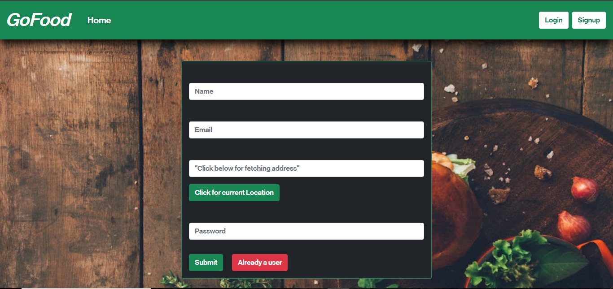
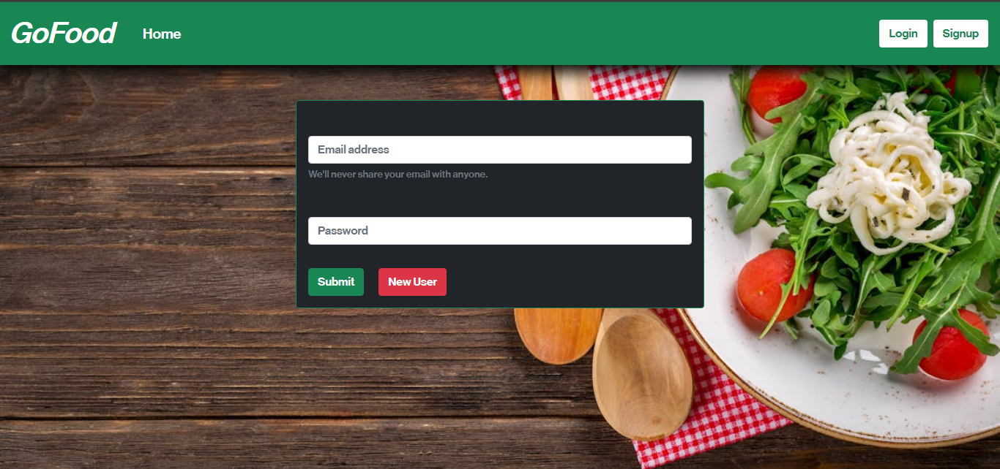
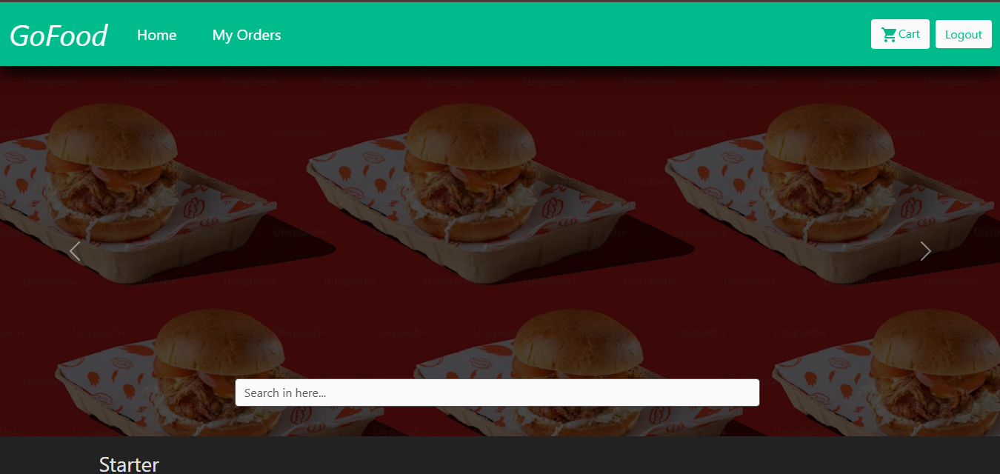
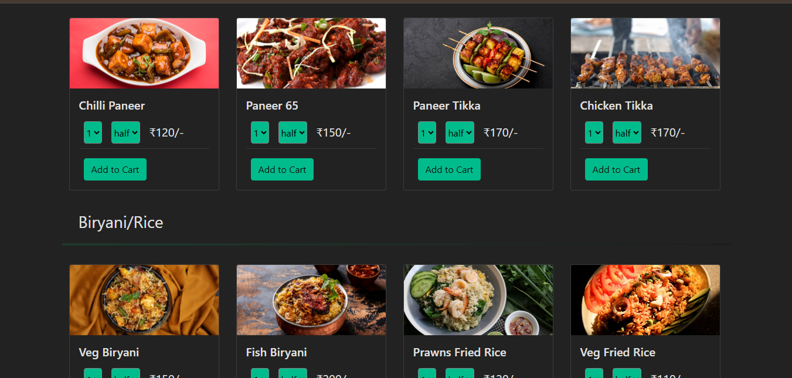
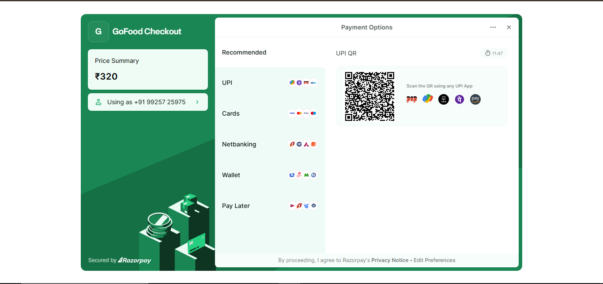

# Tasty Routes 😋

Introducing "Tasty Routes 😋" a food ordering web application crafted with the powerful MERN stack—MongoDB, Express.js, React.js, and Node.js. This innovative platform seamlessly integrates the best of each technology to provide users with a delightful and efficient dining experience.

## 🚀 About the Project & Features

Tasty Routes offers a comprehensive suite of features designed for a seamless and secure food ordering process:

* **Frontend & State Management:** Built with **React** for a dynamic, responsive user interface, and managed centrally using **Redux** for predictable state handling.
* **Backend & Database:** Powered by a robust **Node.js** backend connected to a **MongoDB** database for fast and reliable data operations.
* **Authentication & Security:** Secure user registration and login are implemented using **JWT** (JSON Web Tokens) for authorization and **bcrypt** for encrypted password hashing.
* **Smart Location Detection:** Integrates the browser's **Geolocation API** directly on the signup page to automatically fetch and save the user's exact delivery location.
* **Interactive Cart System:** * Users can seamlessly add and remove items from their cart while browsing.
    * Clicking the cart icon navigates to a dedicated cart review page featuring the selected items, quick "Remove from Cart" options, and a direct checkout button.
* **Secure Payments:** Integrated with the **Razorpay** payment gateway for smooth, reliable, and secure transaction processing.
* **Order History:** A dedicated tracking page where users can review their past orders and payment history.

---
## Requirements

For development, you will only need Node.js and a node global package, installed in your environement.

### Node

If the installation was successful, you should be able to run the following command.

    $ node --version
    v12.22.12

    $ npm --version
    6.14.16

If you need to update `npm`, you can make it using `npm`! Cool right? After running the following command, just open again the command line and be happy.

    $ npm install npm -g

###

## Install

    $ git clone https://github.com/vikas-6511/Tasty-Routes.git
    $ cd Tasty-Routes
    $ npm install

## Running the project

    $ npm run backend
    $ npm start

# ScreenShots
---

